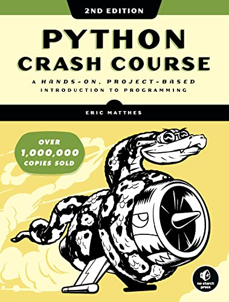
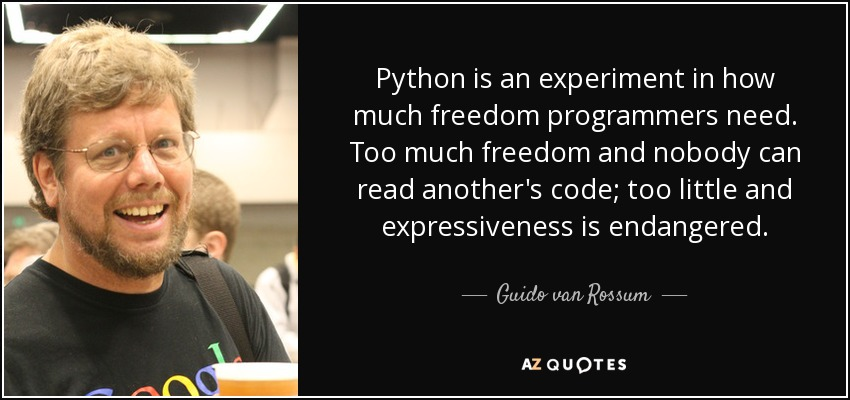

# PYTHON_CRASH_COURSE

B r i e f C o n t e n t s

Part I: Basics
--------------

Chapter 1: Getting Started

Chapter 2: Variables and Simple Data Types

Chapter 3: Introducing Lists

Chapter 4: Working with Lists

Chapter 5: if Statements

Chapter 6: Dictionaries

Chapter 7: User Input and while Loops

Chapter 8: Functions

Chapter 9: Classes

Chapter 10: Files and Exceptions

Chapter 11: Testing Your Code

